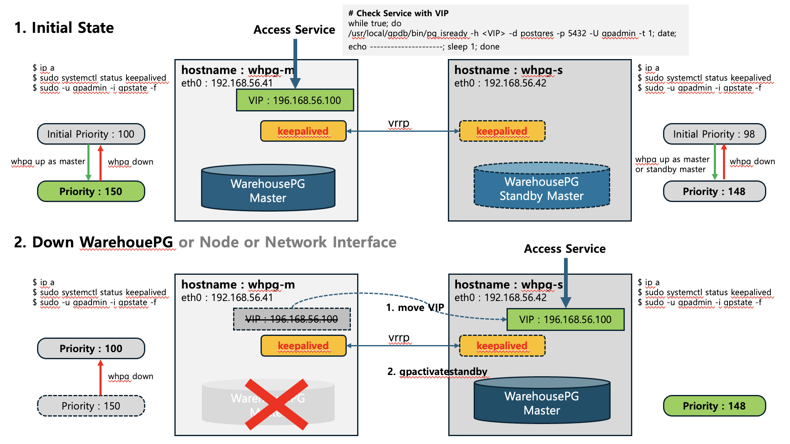

## This repo is for HA for WarehousePG Coordinator node.

### VRRP fail detect algorithm 
VRRP (Virtual Router Redundancy Protocol) is a protocol that provides redundancy for devices like routers and servers to ensure high availability in a network. It operates multiple devices as a single virtual device, so that if the primary device fails, the backup device immediately takes over, preventing service interruptions. <br>
VRRP(Virtual Router Redundancy Protocol)는 네트워크의 **고가용성(High Availability)**을 위해 라우터나 서버 같은 장비를 이중화하는 프로토콜입니다. 여러 대의 장비를 하나의 가상 장비처럼 동작시켜, 주(Master) 장비에 장애가 발생해도 예비(Backup) 장비가 즉시 그 역할을 이어받아 서비스 중단을 방지합니다.

|Category 구분 | Failure Type 장애 유형 | Detection Method 감지 방식 | Failover Time 페일오버시간 |
-----|---------|---------|--------------|
|Timeout-based Method	| Network Failure (Packet Loss) | Detected by BACKUP via timeout | Approx. 3 seconds (Master_Down_Interval) |
|타임아웃 방식	| 네트워크 장애 (패킷 유실) | 원격 노드(BACKUP)에서 타임아웃으로 감지 | 약 3초 (Master_Down_Interval) |
|Event-based Method | Server/Interface Failure | Direct event detection on MASTER | Immediate (Near-zero seconds) |
|이벤트 방식 | 서버 다운, 인터페이스 장애 | 로컬 노드(MASTER)에서 이벤트로 직접 감지 | 즉시 (거의 0초) |




### setup keepalived at master and standby Master
 ```
sudo dnf install -y keepalived 

echo "net.ipv4.ip_forward = 1" | sudo tee -a /etc/sysctl.conf
echo "net.ipv4.ip_nonlocal_bind = 1" | sudo tee -a /etc/sysctl.conf # Allow VIP to not be bound locally
sudo sysctl -p
 ```

Allow VRRP protocol if firewall using <br>
 ```
sudo firewall-cmd --permanent --add-rich-rule='rule protocol value="vrrp" accept'
 ```
Allow specific multicast addresses (VRRP uses 224.0.0.18 multicast) if firewall using <br>
 ```
sudo firewall-cmd --permanent --add-rich-rule='rule family="ipv4" destination address="224.0.0.18" protocol="vrrp" accept'
sudo firewall-cmd --reload # Reload the firewall to apply the changes
 ```

### folder / files
 ```
/etc/keepalived/keepalived.conf     # keepalived.conf.master for MASTER, keepalived.conf.backup for BACKUP
/etc/keepalived/check_my_service.sh # check_my_service.sh.master for MASTER, check_my_service.sh.backup for BACKUP
/etc/keepalived/notify_master.sh
/etc/keepalived/notify_state_change.sh
/etc/keepalived/notify_stop.sh
 ```
### change scripts
```
DB_HOST="whpg-m"     # hostname (or IP address)
DB_PORT="5432"       # port
DB_USER="gpadmin" 
VIP 192.168.56.100
COORDINATOR_DATA_DIRECTORY=/data/master/gpseg-1
and so on.
```
### Change Owner and Permission
 ```
sudo chmod +x /etc/keepalived/*.sh
sudo chown gpadmin:gpadmin /etc/keepalived/*
sudo usermod -aG wheel gpadmin

sudo visudo          # add below for gpadmin account. 
gpadmin ALL=(gpadmin) NOPASSWD: /bin/bash
 ```

### Start Keepalived Service
 ```
sudo systemctl enable keepalived
sudo systemctl start keepalived
sudo systemctl reload keepalived    # after change configuration of keepalived
 ```
### Check Keepalived Service 
 ```
sudo systemctl status keepalived
sudo journalctl -u keepalived -f
sudo tail -f /var/log/messages | grep Keepalived
 ```
### Check VIP 
 ```
nmcli connection show
ip a
ip a show [InterfaceName]

while true; do /usr/local/greenplum-db/bin/pg_isready -h <VIP> -d postgres -p 5432 -U gpadmin -t 1; date; echo ---------------------; sleep 1; done
 ```
### Check VRRP Packet
 ```
sudo tcpdump -i [InterfaceName] vrrp
sudo tcpdump -i [InterfaceName] -n "proto 112"

sudo tcpdump -i [InterfaceName] ah             # for IPsec AH 
sudo tcpdump -i [InterfaceName] -n "proto 51"  # for IPsec AH 

ex)
sudo tcpdump -i eth1 vrrp
sudo tcpdump -i eth1 -n "proto 112"

sudo tcpdump -i eth1 ah
sudo tcpdump -i eth1 -n "proto 51"
 ```

### WARNING
If you want to perform VIP and DB failover only in case of server or network failure. <br>
change keepalived.conf at BACKUP(standby master) node.<br>
 ```
vrrp_instance VI_1 {
    ..
    nopreempt      # if set preempt, when DB down, VIP and DB failover to BACKUP Node
                   # if set nopreempt, when DB down, no failover to BACKUP Node
    ..

 ```

### Keepalived RPM Dependency.
```
libnl: A library that uses the Netlink protocol. It is essential for keepalived to handle the network interface and routing table information required to send and receive VRRP (Virtual Router Redundancy Protocol) messages.
libnfnetlink: A library used for features such as Netfilter connection tracking.
libmnl: A low-level library for handling Netlink messages.
openssl: An SSL/TLS protocol library. It may be required for keepalived's communication security or for certain authentication methods.
systemd: Required for managing keepalived as a system service. Systemd is responsible for starting, stopping, and restarting the keepalived process.
libcap: A library for process permissions management. It is used by keepalived to securely grant permissions for certain network operations.
popt: A library for parsing command-line options. It is required for keepalived to process various command-line arguments.
coreutils: A package containing core Linux utilities such as chown, chmod, and ln.

```

## Scenario : Failover 
```
if nopreempt mode in BACKUP, failover only at Server down, Interface down, except when DB down.
if preempt mode in BACKUP, failover at Server down, Interface down and DB down.

Failover means that BACKUP node will be Master node of WarehousePG and VIP also move to BACKUP node.

check at BACKUP node
 $ sudo ip a
 $ sudo systemctl status keepalived
 $ gpstate 
```

## Scenario : Restore Failed Node 
```
When failed node start up normaly, make it standby node of WarehousePG by following
1. At failed node
   check $MASTER_DATA_DIRECTORY, and rm -rf $MASTER_DATA_DIRECTORY or mv $MASTER_DATA_DIRECTORY $MASTER_DATA_DIRECTORY.org
2. At Backup node( currently Master node of WarehousePG )
   $ gpinitstandby -s failed_node_ip
```

## Scenario : Failback, return to original state
```
when master and standby is running, do following command at current Master node.
$ kill -9 postgres_pid
or
$ pg_ctl -D $MASTER_DATA_DIRECTORY stop

then, ..
The keepalived move VIP to original master node and run gpactivatestandby at original master node

and then
make new standby node of WarehousePG at Master node.
$ gpinitstandby -s backup_node
```


